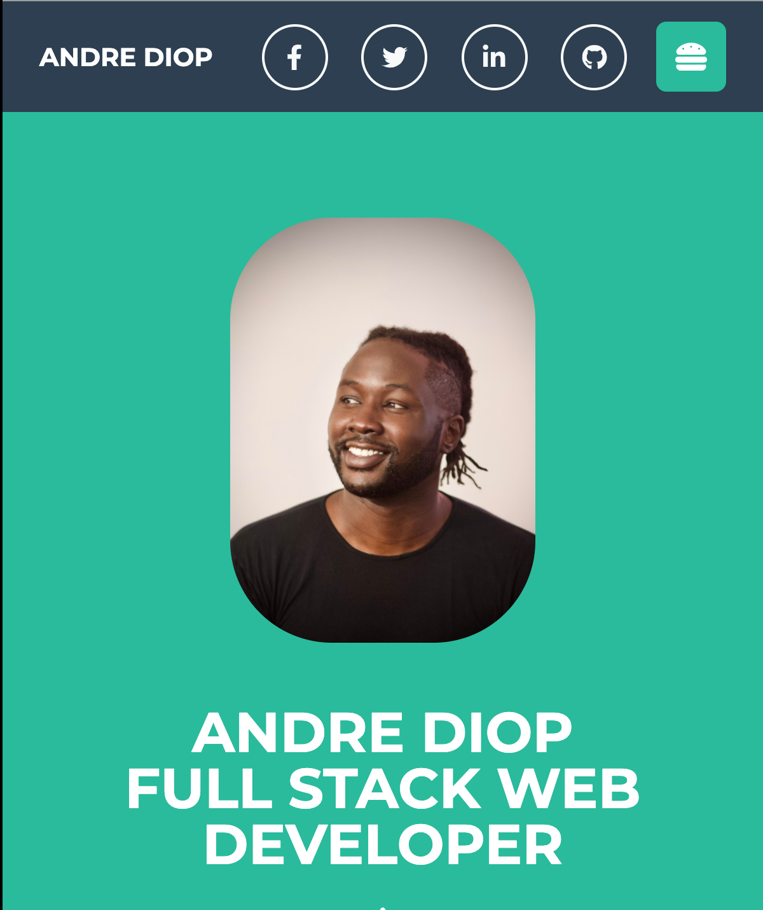

# Portfolio

## Table of Contents

[About](https://github.com/AndreDiop/Portfolio/blob/main/README.md#About)

[Installation](https://github.com/AndreDiop/Portfolio/blob/main/README.md#Access)

[Usage](https://github.com/AndreDiop/Portfolio/blob/main/README.md#Usage)

[Screenshots](https://github.com/AndreDiop/Portfolio/blob/main/README.md#Screenshots)

[Contributing](https://github.com/AndreDiop/Portfolio/blob/main/README.md#Contributing)

[Licenses](https://github.com/AndreDiop/Portfolio/blob/main/README.md#Licenses)

# About

This is a living document of the skills and work that I will display to potential employers

## Access

Users will access the page through either the direct link to the deployed application

[Link to deployed site](https://andrediop.github.io/Portfolio/)

or through the Github repository

[Link to Github repository](https://github.com/AndreDiop/Portfolio)

## Usage

This will be where I display my skill of web development. Visitors will be able to reach me through a variety of mediums including; email, telephone, linkedin, facebook and twitter
## Screenshots

## Contributing

This app couldn't have been built with out guidance from fellow students, instructors, tutors, and TA's of the Georgia Tech full stack coding bootcamp.

I'm always looking to learn and collaborate, please don't hesistate to reach out to me!

## License

[MIT](https://choosealicense.com/licenses/mit/)
